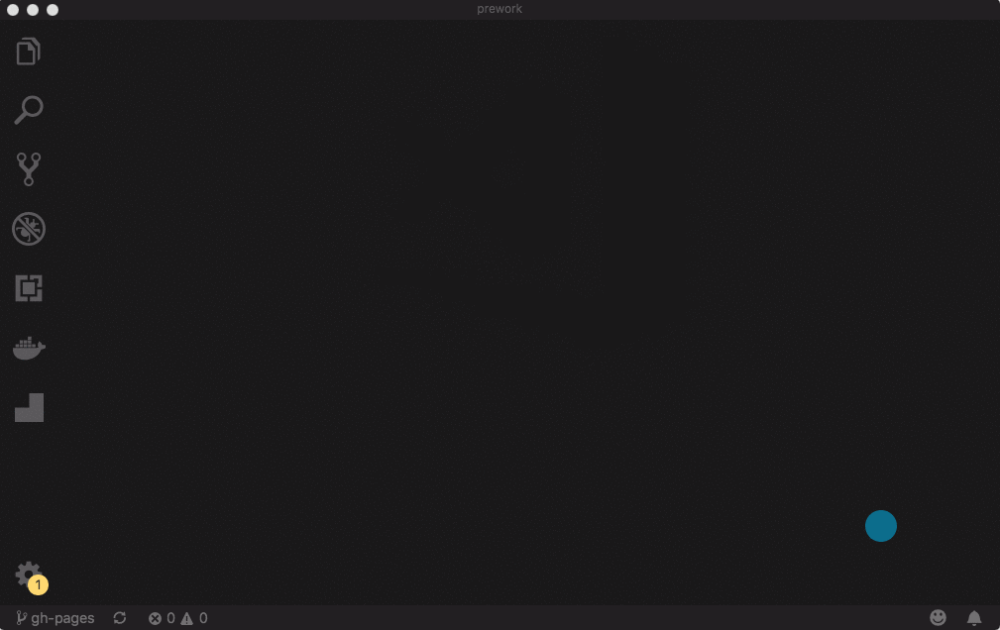
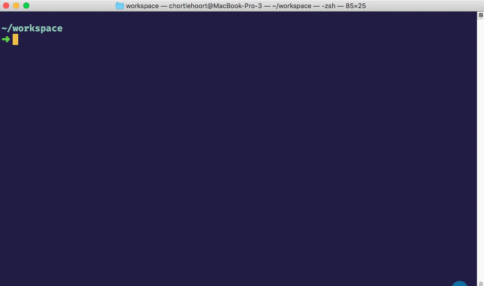
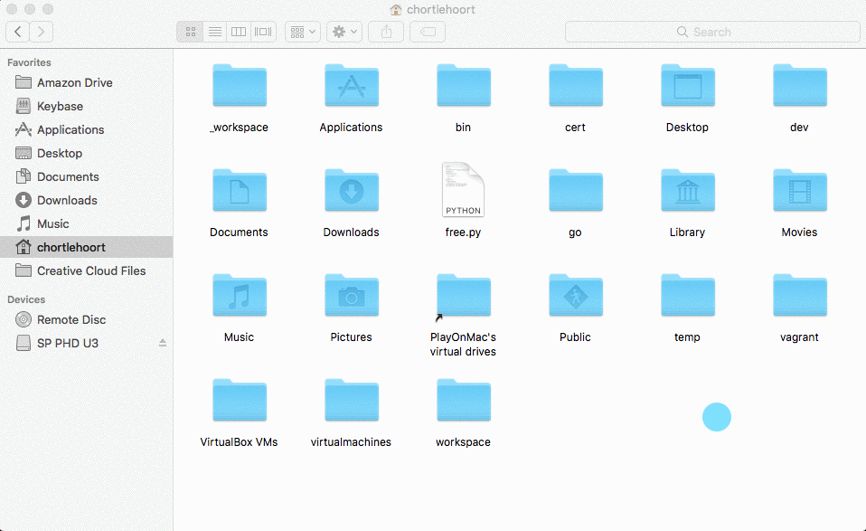
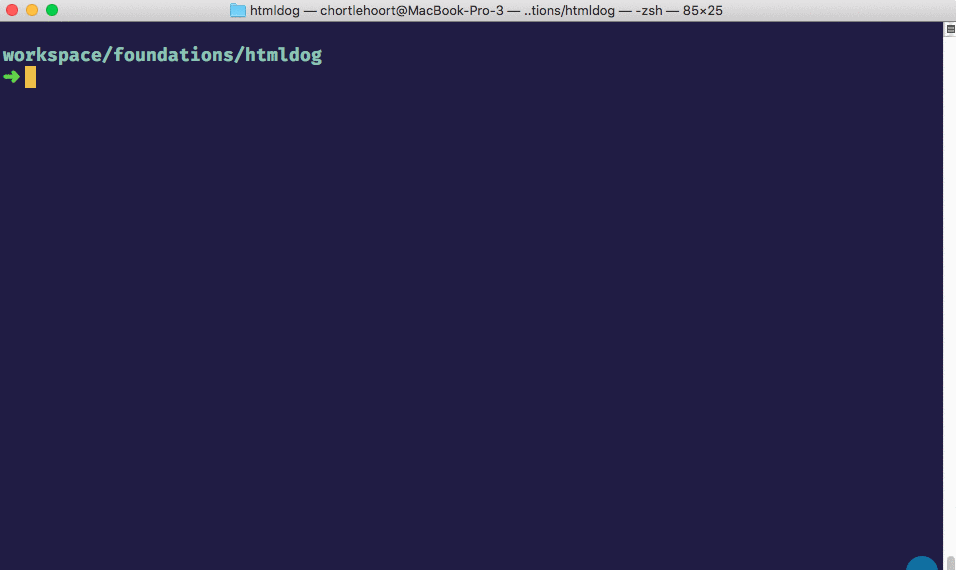
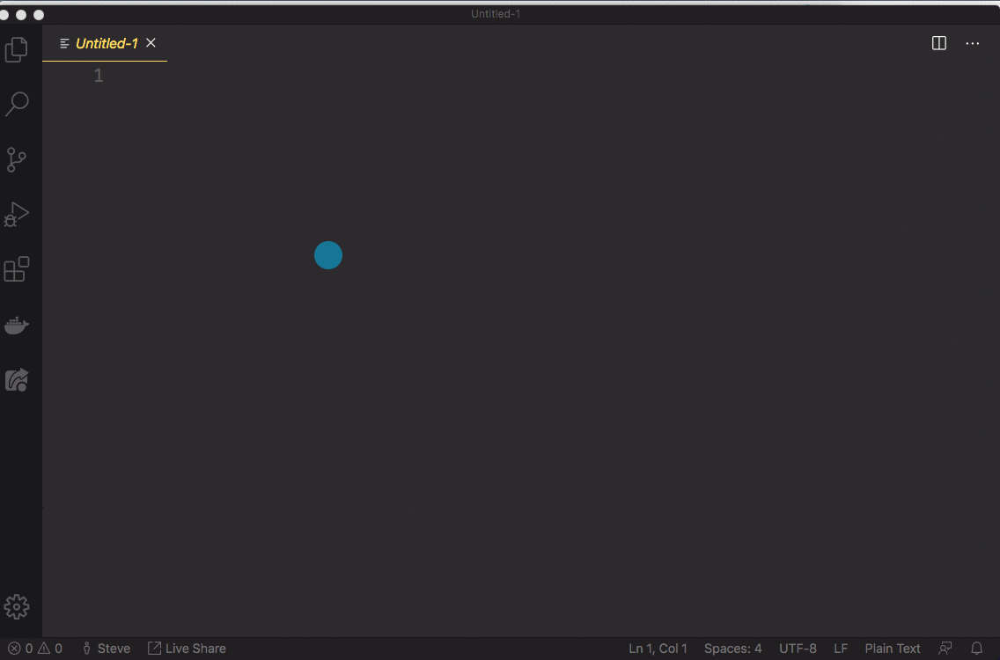
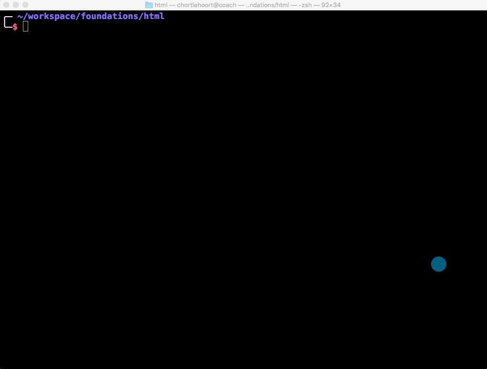
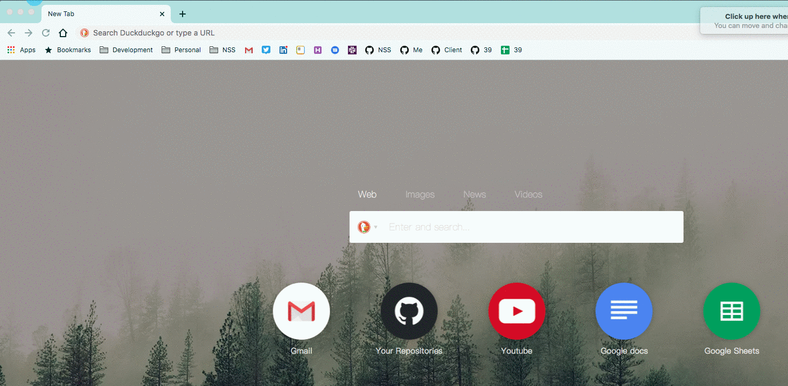

[Welcome](../../) > [Book 3 - The Visible Web](../README.md) > HTML Dog - Beginner HTML

# HTML Dog - Beginner HTML Tutorial

Another free web site that contains a large set of tutorials is *HTML Dog*. That is where you are headed next to practice using the HTML elements you first learned at Codecademy.

The next step is to build your own web page on your computer instead of the integrated editor and browser that Codeacemy gives you. To set you up for success, follow these instructions before moving on to the assignment.

## Setup for Coding on Your Machine

### Visual Studio Code

You need to make sure that you can run Visual Studio Code from the command line. It will make your life tremendously easier once you get the hang of it.

1. Run the Visual Studio Code application.
1. Open the command list by typing in the keyboard shortcut that applies to you.
    1. On Windows, `control+shift+p`
    1. On Mac, `shift+command+p`
1. A list of commands will immediately appear with an input field.
1. Type in the following text, "shell command" and the list of command will filter down to 2 options.
1. Select the _**Install 'code' command in PATH**_ option.
    > If ths option doesn't appear for you, that's fine. You will need to open your directory manually on step 9 below.
1. Close Visual Studio Code and move on to the next series of instructions.



### Directories and Files

> **IMPORTANT:** For the Foundations Course, when you see the words "terminal" or "command line", it means Git Bash for Windows users. For Mac users, it is the Terminal application.

1. If you did not install everything that was listed in the previous book, please go back and do that. You will need Visual Studio Code installed as your code editor.
1. Open your terminal and change your location to your home directory.

    ```sh
    cd ~
    ```

1. Make a new sub-directory named `workspace` and use `cd` to move to that directory. Try your tab completion skills with the `cd` command. Type just the first couple of letters and hit your tab key.

    ```sh
    mkdir workspace
    cd workspace
    ```

1. This is the directory which will contain all of the work that you do while you are at NSS. While you are working through the *Foundations Course*, make sure it is separated from the work you will do in class. Make a new sub-directory inside workspace named `foundations`.

    ```sh
    mkdir foundations
    cd foundations
    ```

1. You will be working on HTML, CSS and JavaScript during the HTML Dog project, so to keep your work organized, make a new directory in foundations for that work.

    ```sh
    mkdir htmldog
    ```
    

    This is how your directory structure will look in Mac Finder or Windows File Explorer.

    

1. Now use your `pwd` command to see where you are currently located in your terminal. You should see the following path at the end of the output. There will be more information to the left, but that is different for everyone. As long as the last three directory look like the path below, you are fine.

    ```sh
    workspace/foundations/htmldog
    ```

1. The HTML Dog project asks you to create a file named `myfirstpage.html` so you can create it in this directory. Use the `touch` command to create the file and then use the `ls` command to list the contents of the directory.

    ```sh
    touch myfirstpage.html
    ls
    ```

    
1. Now start your Visual Studio Code editor and it will start with the files in this directory automatically ready to be accessed and edited. Putting the dot after the `code` command is important - don't forget it.

    ```sh
    code .
    ```

    If you were not able to get the _**Install 'code' command in PATH**_ command to work earlier, then you will need to do one of the following.
    * On Windows, click the File menu at the top and choose "Open Folder". Then find the `workspace/foundations/htmldog` directory and double-click it.
    * On Mac hit the `Command+O` key combination. Then find the `workspace/foundations/htmldog` directory and double-click it.

    
1. Once Code finishes loading, on the left you will see the `myfirstpage.html` file. Double-click it to start editing. You can even start typing "html" and choose the "html:5" option to get some boilerplate code given to you.
    
1. Open Chrome and click the File menu at the top and choose _Open file..._
1. Browse to your **htmldog** directory and open the `myfirstpage.html` file. This will open your web page in the browser.
    
1. Now you're ready to start on your next assignment. Read the notes below before you begin.

> **NOTE:** HTML Dog suggests you use Notepad, but you will use Visual Studio Code as your editor.

> **NOTE:** While you are working, if you close Chrome completely, or just the tab you are working on, you can always open a new tab and use `ctrl+O` on Windows or `command+O` on Mac to open your file again. That's an O, not a zero.

## Assignment

Visit and complete the [HTML Beginner Tutorial](https://www.htmldog.com/guides/html/beginner/) course on HTML Dog. They estimate that it will take four hours of your time to read the content, work on exercises, and complete the project(s) they assign you. We want you to start with this course because it has you coding immediately, not doing a lot of reading about theory.
